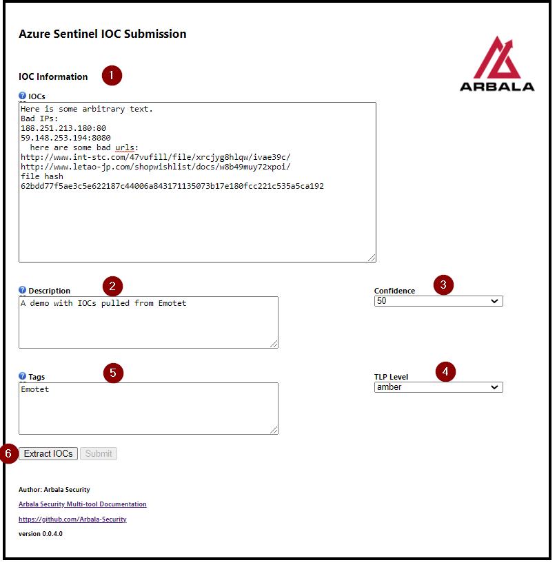
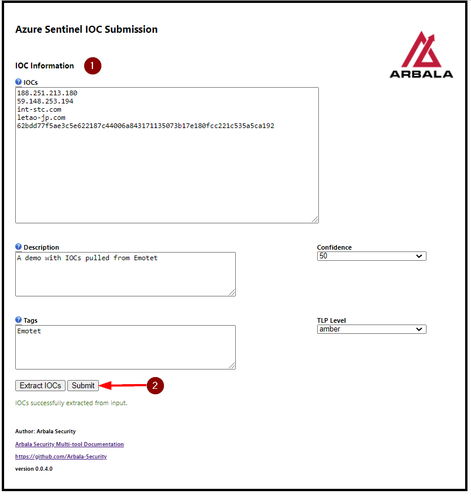
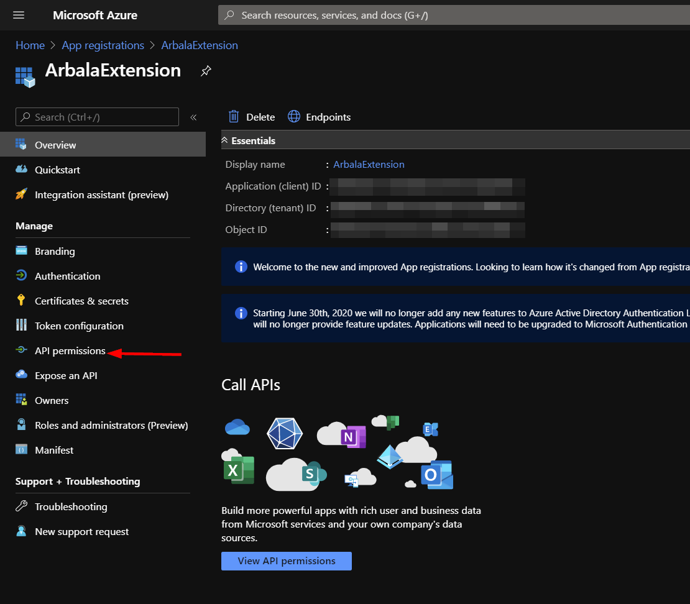
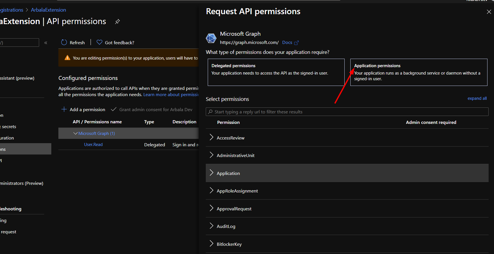

# Arbala Security Multi-tool Extension

Author: Arbala Security

For any technical questions, please contact info@arbalasystems.com   

Currently, this browser extension allows you to create multiple Microsoft Graph threat intelligence (TI) indicator records on the fly. Our team is actively working on additional features to add to this tool. 

## Sentinel IOC Submission

Item 1 is the Indicators of Compromise (IOCs) you wish to have (TI) indicator records created for. We have now added support for submission of domains, IPv4 address, and hashes(MD5 and SHA256 only)- all at the same time! IOCs should be separated by space, comma, or a new line. Due to API limits, only 100 IOCs may be submitted at one time.

Item 2 is what will be the value of the Description field on the (TI) indicator record the extension will create for you. 

This is technically a required field, but should you leave it blank, a value of "IOC submitted from Arbala Security Multi-tool." will be filled in before the request to create the record is sent.

Item 3 is the confidence score you would like to give the indicators you are submitting. Options are 0, 25, 50, 75, and 100. 

Item 4 is the TLP level. You can choose from RED, AMBER, GREEN, and WHITE. See the TLP Wiki for more info - https://en.wikipedia.org/wiki/Traffic_Light_Protocol

Item 5 is the tags you would like to add to your IOCs. These will be separated by commas and/or whitespace.

Item 6 is the "Extract IOCs" button. This is what will ready the request to have your records created and also what will classify each item as either a domain, ip, or hash.  Domains will be parsed out of urls. Any input which we are unable to classify will be tossed out.

After clicking the "Extract IOCs" button, you should see the accepted IOC values neatly formatted in the IOCs input field. At this point, the "Submit" button will be enabled. If all looks well, go ahead and submit them for creation in Microsoft Graph!

## Configuration

In order to for this extension to make successful API callouts to authenticate and create (TI) indicator records, you will need to create an App Registration in your Azure org.

Follow the steps below to obtain items 1-3 needed for configuration.

#
From your Azure home page, locate the App Registrations service and click "New registration".

Enter a name for the registration and click "Save".

Take note of the client and tenant ids, as these are the first two items needed to configure your extension. To obtain the final item, navigate to the "Certificates & secrets" option on the left menu panel.

Click "New client secret".

Once you have created your new secret, take down the generated value, as this will be inaccessible later. This is the third and final item you will need to configure your extension.

#

Next you will need to grant a permission to this app registration so that your extension can use it to create (TI) indicator records for you. Click the "API permissions" option in the left menu panel.

Click the "Microsoft Graph" permission.

Click "Application permissions".

Scroll down to the "ThreatIndicators" API permission settings and mark the checkbox for "ThreatIndicators.ReadWrite.OwnedBy". Click the "Update permissions" button.

 #
