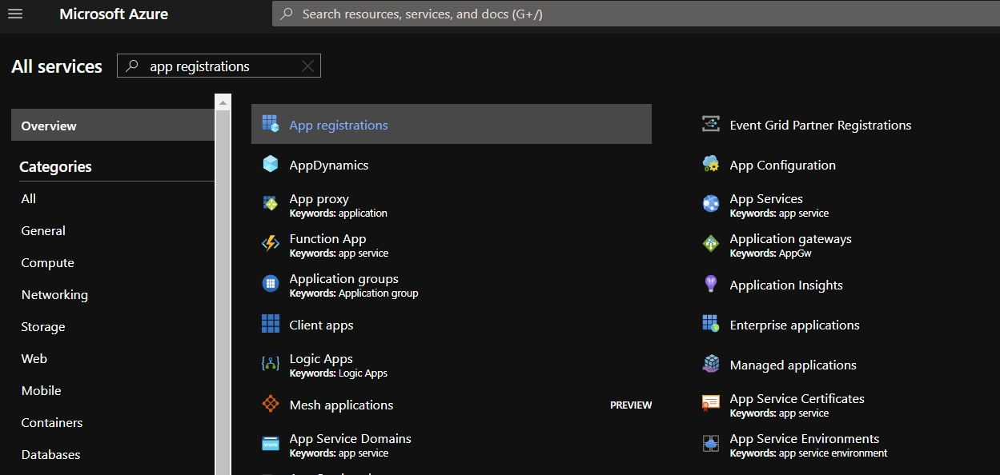
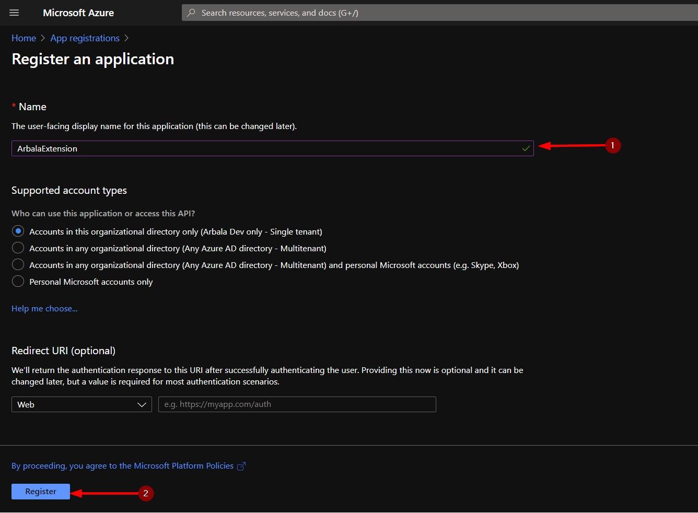
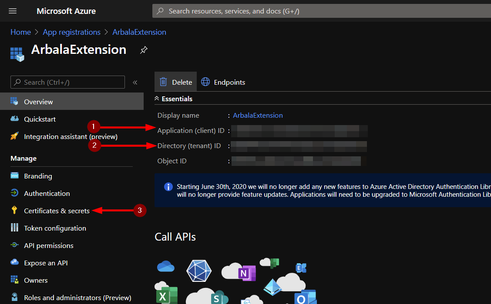
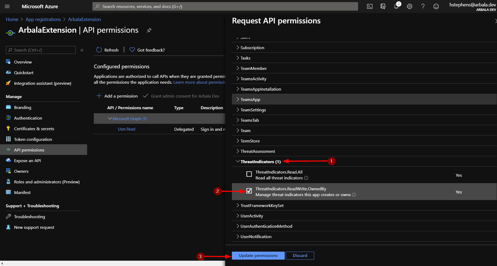

# Arbala Security Multitool Extension

Author: Arbala Security

For any technical questions, please contact info@arbalasystems.com   

Currently, this browser extension allows you to create Microsoft Graph threat intelligence (TI) indicator records on the fly. Our team is actively working on additional features to add to this tool. 
                                            

## Configuration

In order to for this extension to make successful api callouts to authenticate and create records, you will need to create an app registration in your org.

Follow the steps below to obtain items 1-3 needed for configuration.

#
From your Azure home page, locate the app registrations service and create a new registration.

Enter a name for the registration and click save.

Take note of the client and tennant ids, as these are the first two items needed to configure your extension. To obtain the final item, navigate to "Cetrtificates & secrets" on the left menu panel.

Click new secret.

Once you have generated your new secret, take down the value as this will be inaccessible later. This is the third and final item you will need to configure your extension.

Next you will need to add some permissions to this app registration so your extension can use it to create ti indicator records. Click the API permissions option in the left menu panel.

Click the Microsoft Graph permission.

Scroll down to the "ThreatIndicators" API permission settings and mark the checkbox for "ThreatIndicators.ReadWrite.OwnedBy". Click the Update permissions button.

 #
