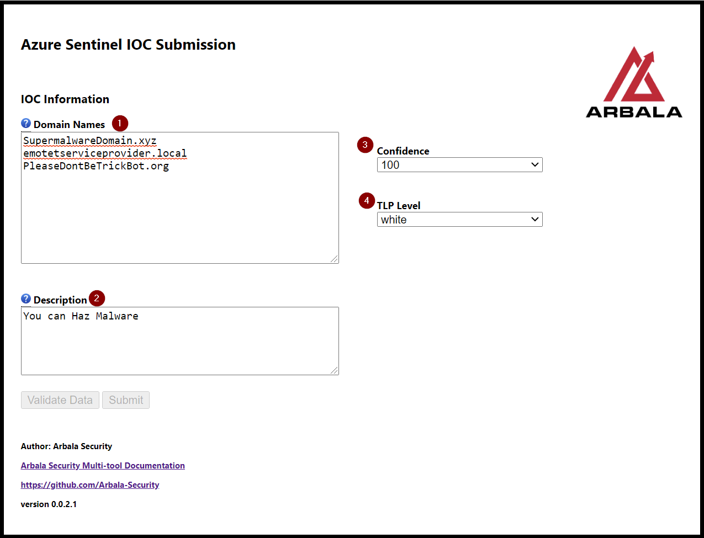
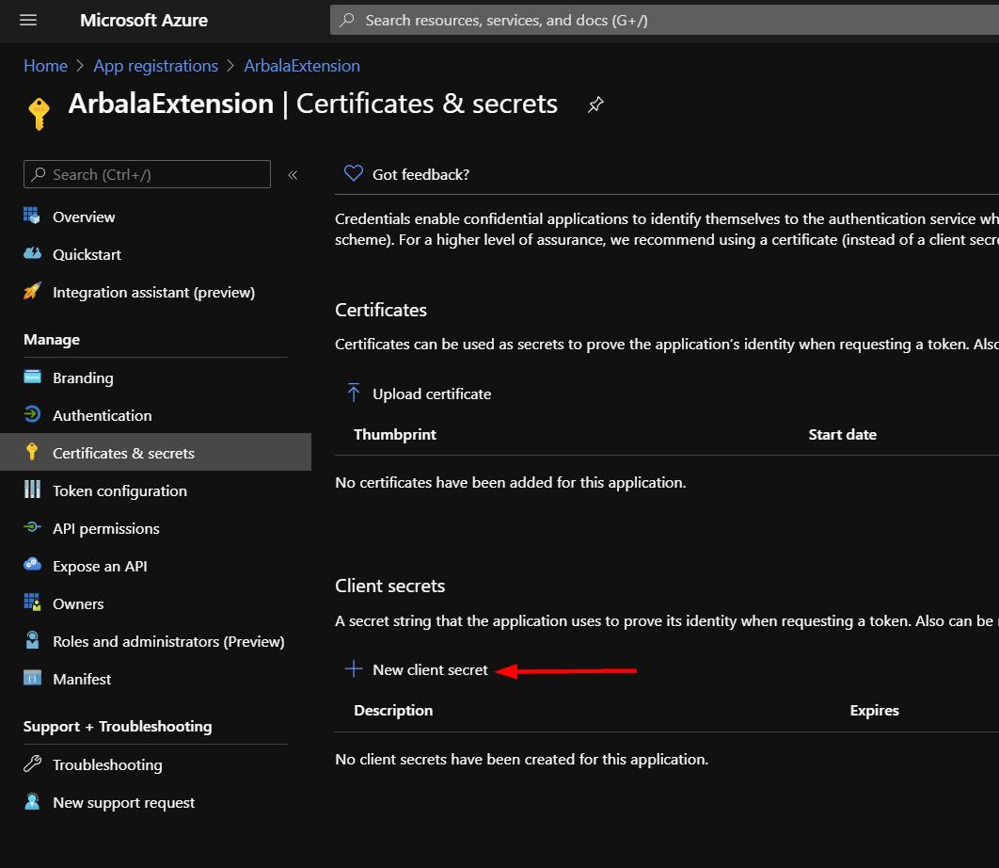
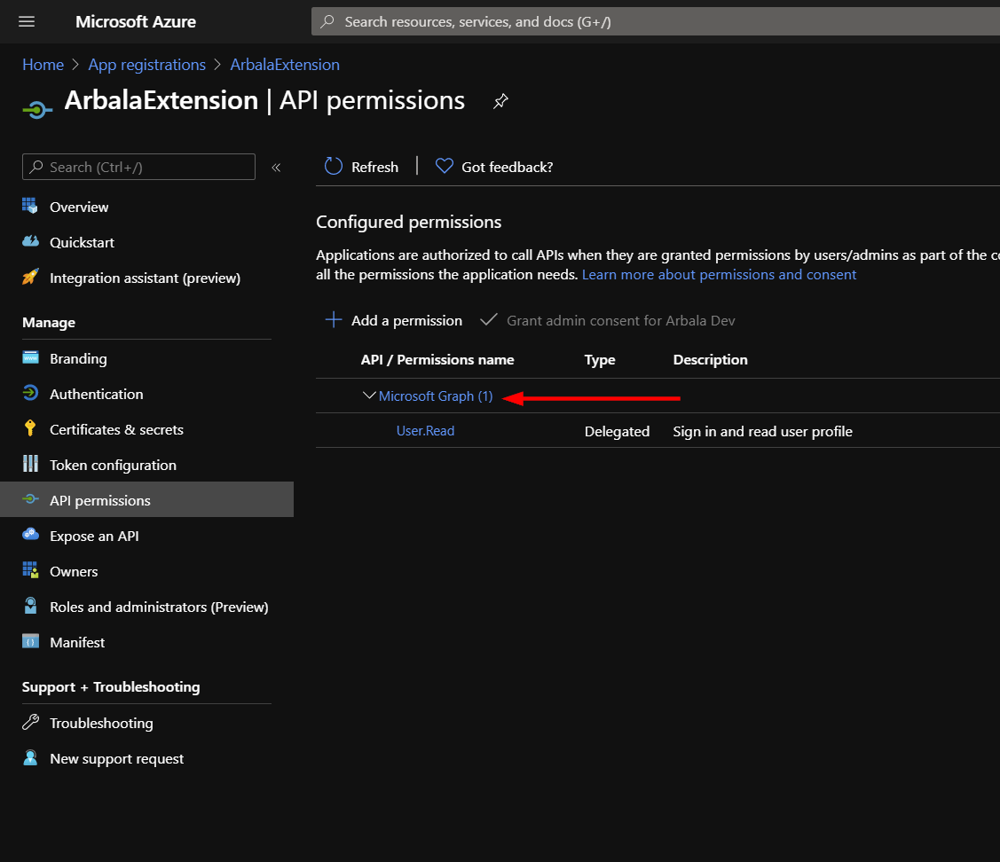

# Arbala Security Multitool Extension

Author: Arbala Security

For any technical questions, please contact info@arbalasystems.com   

Currently, this browser extension allows you to create Microsoft Graph threat intelligence (TI) indicator records on the fly. Our team is actively working on additional features to add to this tool. 

## Sentinel IOC Submission

Item 1 is the domain you wish to have (TI) indicator record created for. Enter this in the form '[xxxx].[TLD]'. Currently, functionality only supports submission of one domain at a time.

Item 2 is what will be the value of the Description field on the (TI) indicator record the extension will create for you. This is technically a required field, but should you leave it blank, a value of "IOC submitted from Arbala Security Multitool." will be filled in before the request to create the record is sent.

## Configuration

In order to for this extension to make successful API callouts to authenticate and create (TI) indicator records, you will need to create an App Registration in your Azure org.

Follow the steps below to obtain items 1-3 needed for configuration.

#
From your Azure home page, locate the App Registrations service and click "New registration".

Enter a name for the registration and click "Save".

Take note of the client and tennant ids, as these are the first two items needed to configure your extension. To obtain the final item, navigate to the "Cetrtificates & secrets" option on the left menu panel.

Click "New secret".

Once you have created your new secret, take down the generated value, as this will be inaccessible later. This is the third and final item you will need to configure your extension.

#

Next you will need to grant a permission to this app registration so that your extension can use it to create (TI) indicator records for you. Click the "API permissions" option in the left menu panel.

Click the Microsoft Graph permission.

Scroll down to the "ThreatIndicators" API permission settings and mark the checkbox for "ThreatIndicators.ReadWrite.OwnedBy". Click the "Update permissions" button.

 #
